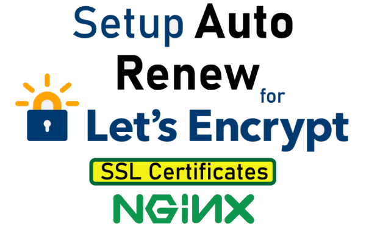

<p align="center">
  
</p>

<h1 align="center">Install Free Let’s Encrypt SSL Cert with Nginx</h1>

<p align="center">
  
</p>

# Table of Contents

- [Introduction]
- [Setting up Nginx]
- [Setting up Let’s Encrypt SSL]
- [Setting up Auto - Renewal Cron Job]
- [How to Revoke a Certificate?]
- [Qualys SSL Labs Test] 
- [Copyright]

##

## Introduction

Let’s Encrypt is a Certificate Authority (CA) that provides an easy way to obtain and install free TLS/SSL certificates, thereby enabling encrypted HTTPS on web servers.
Currently, the entire process of obtaining and installing a certificate is fully automated on both Apache and Nginx web servers. In this article, I will show you how to set it up for Nginx.

## Setting Up Nginx

##### Step 1: Installing Nginx

```
$ sudo apt-get update
$ sudo apt-get install certbot python-certbot-nginx
```
##### Step 2: Create .well_known directory

```
$ mkdir /usr/share/nginx/html/.well_known
```
## Setting up Let’s Encrypt SSL

##### Step 1: Downloading Let’s Encrypt

Clone the letsencrypt client into the `/opt/letsencrypt` folder.

```
$ git clone https://github.com/letsencrypt/letsencrypt /opt/letsencrypt
```

###### Fix Locale Error

While requesting the certificate, Sometimes I have come across some locale error. To fix that, update the following environment variables:

```
$ export LC_ALL="en_US.UTF-8"
$ export LC_CTYPE="en_US.UTF-8"
```

##### Step 2: Creating a Let's Encrypt SSL Cert

We can create a cert using the following command. Note that you'll need to change the domain name.

- `mysite.com` should be replaced with your domain

```
$ /opt/letsencrypt/letsencrypt-auto certonly --webroot -w /usr/share/nginx/html -d 'mysite.com,www.mysite.com'
```

##### Step 3: Restart the Nginx Server

After successfully creating the certificate, you will need to restart nginx.
```
$ sudo service nginx restart
```

## Enhancing Security (Optional)

Once you have the certificate and chain saved on the server, you can check the Nginx configuration to further tune the HTTPS connection using the new certificates.

- Only use secure protocols

  Enables the two most secure TLS versions `1.1` and `1.2`

  ```
  ssl_protocols TLSv1.1 TLSv1.2;
  ```

- Enable HTTP Strict Transport Security (HSTS)

    Enable HSTS in by using the option as shown below
    ```
    add_header Strict-Transport-Security "max-age=31536000; includeSubdomains";
    ```
- Diffie-Hellman Ephemeral algorithm

    Generate a strong DHE parameter using the command below.
    ```
    $ ssl_dhparam /etc/ssl/certs/dhparam.pem;
    ```
- Enhance cypher suites

    The cypher suites enable security between your web server and visitors clients by defining how secure communication takes place.
    
    ```
    ssl_ciphers ECDHE-ECDSA-AES128-GCM-SHA256:ECDHE-ECDSA-AES256-GCM-SHA384:ECDHE-ECDSA-AES128-SHA:ECDHE-ECDSA-AES256-SHA:ECDHE-ECDSA-AES128-SHA256:ECDHE-ECDSA-AES256-SHA384:ECDHE-RSA-AES128-GCM-SHA256:ECDHE-RSA-AES256-GCM-SHA384:ECDHE-RSA-AES128-SHA:ECDHE-RSA-AES256-SHA:ECDHE-RSA-AES128-SHA256:ECDHE-RSA-AES256-SHA384:DHE-RSA-AES128-GCM-SHA256:DHE-RSA-AES256-GCM-SHA384:DHE-RSA-AES128-SHA:DHE-RSA-AES256-SHA:DHE-RSA-AES128-SHA256:DHE-RSA-AES256-SHA256;
    ```    
    ```
    ssl_prefer_server_ciphers on;
    ```
- Redirect unencrypted connections
    
    Optionally you can add a redirection from your HTTP connections to the encrypted HTTPS.

    ```
    server {
        listen 80;
        server_name mysite.com;
        return 301 https://$server_name$request_uri;
    }
    ```
- Adding it all to the configuration
    Create a new configuration file with the command below.
    ```
    $ sudo nano /etc/nginx/sites-enabled/mysite.com
    ```
    This example configuration sets up a single site listening for HTTPS connections with the added security features as explained above. 
    
    * Replace `mysite.com` in the example underneath with your own domain.

    
    ```
    # HTTPS server
    server {
        listen 443 ssl;
        server_name mysite.com;
        ssl_certificate /etc/letsencrypt/live/mysite.com/fullchain.pem;
        ssl_certificate_key /etc/letsencrypt/live/mysite.com/privkey.pem;
        ssl_session_cache shared:SSL:10m;
        ssl_session_timeout 5m;
        ssl_protocols TLSv1 TLSv1.1 TLSv1.2;
        ssl_prefer_server_ciphers on;
        ssl_dhparam /etc/ssl/certs/dhparam.pem;
        ssl_ciphers ECDHE-ECDSA-AES128-GCM-SHA256:ECDHE-ECDSA-AES256-GCM-SHA384:ECDHE-ECDSA-AES128-SHA:ECDHE-ECDSA-AES256-SHA:ECDHE-ECDSA-AES128-SHA256:ECDHE-ECDSA-AES256-SHA384:ECDHE-RSA-AES128-GCM-SHA256:ECDHE-RSA-AES256-GCM-SHA384:ECDHE-RSA-AES128-SHA:ECDHE-RSA-AES256-SHA:ECDHE-RSA-AES128-SHA256:ECDHE-RSA-AES256-SHA384:DHE-RSA-AES128-GCM-SHA256:DHE-RSA-AES256-GCM-SHA384:DHE-RSA-AES128-SHA:DHE-RSA-AES256-SHA:DHE-RSA-AES128-SHA256:DHE-RSA-AES256-SHA256;
        add_header Strict-Transport-Security "max-age=31536000; includeSubdomains";
        location / {
            root /usr/share/nginx/html;
            index index.html index.htm;
        }
    }

    # HTTP redirect
    server {
        listen 80;
        server_name mysite.com;
        return 301 https://$server_name$request_uri;
    }
    ```
    Then save the file and exit the editor.

    To have the changes take effect, you will need to restart nginx.
    ```
    $ sudo service nginx restart
    ```
##

# Setting up Auto - Renewal Cron Job
Create this log file if it doesn’t already exist.

```
$ touch /var/log/le-renew.log
```

To enable automatic renewal of your ssl certificate, follow the following steps to create a Cron task that would handle it automatically for you.
Run this command to open up the crontab:

```
$ sudo crontab -e
```

Paste following below two line in the end of cron tab.

```
30 4 * * 1 /opt/letsencrypt/letsencrypt-auto renew >> /var/log/le-renew.log
35 4 * * 1 /etc/init.d/nginx reload
```

We have registered a new cron job that will execute the auto renew command every Monday at `4:30 am`, and reload Nginx at `4:35am`.
The output produced by the command will be piped to a log file located at `/var/log/le-renew.log`.


Your SSL certificate is now up and running and it gets renewed automatically. You don’t have to keep an eye on it.

# How to Revoke a existing certificate?
If you want to remove a existing certificate from your server it can be revoked using the below given command.
- `mysite.com` should be replaced with your domain which certificate you want to revoke.

```
$ sudo certbot revoke --cert-path /etc/letsencrypt/live/mysite.com/cert.pem

```
The process does not give a confirmation upon completion, but if you perform it again you will get a message that the certificate has already been revoked.

# Qualys SSL Labs Test
You can evaluate the server encryption performance with [Qualys SSL Labs test site](https://www.ssllabs.com/ssltest/index.html). Enter your domain name into the text field and click the Submit button. The test will take a moment, but when completed it provides some useful information on different areas of your server encryption security as well as an overall rating.


### Copyright

Copyright (C) [Faizan AH](https://faizanahmad.herokuapp.com) - All Rights Reserved

- Unauthorized copying of this file, via any medium is strictly prohibited
- Written by [Faizan Ahmad](https://faizanahmad.herokuapp.com), April 2020.
